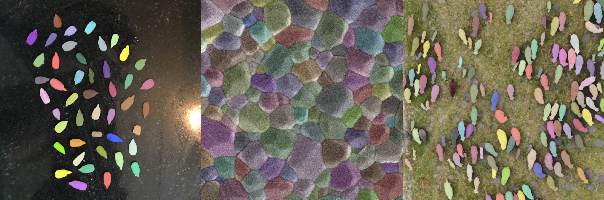
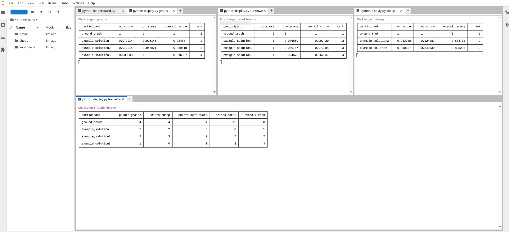

# Segmentation Challenge

The goal of this workshop is to let you practice your segmentation skills by developing automated segmentation workflows for a selection of challenge images.

You can use any tool you want (Fiji, Python, etc.) to generate your segmentation masks. The idea is to test and figure out which methods work best for each image.

Example tools: [Fiji](https://fiji.sc/), [MorpholibJ](https://imagej.net/plugins/morpholibj), [Scikit-image](https://scikit-image.org/), [CellPose](https://www.cellpose.org/), [SAM](https://github.com/facebookresearch/segment-anything), [Ilastik](https://www.ilastik.org/)...

## Images

The challenge images are located in the [`Images`](./Images/) folder.



| Image      | Description |
| ---------- | ----------- |
| sunflowers.tif | An optical image of sunflower seeds. |
| grains.tif | An SEM image of a grain structure. |
| sheep.tif | An aerial photograph of sheep in a field. |

**Image references**: the original image sources are mentioned [here](./Images/_references.txt).

## Ground truths

For each image, a segmentation mask representing the *ground truth* is available in the [`Ground_Truths`](./Ground_Truths/) folder. These ground truth masks have been carefully edited to be as close as possible to an ideal result.

## Submissions

You can share your segmentation masks to see how they compare to the “ground truthˮ and other submissions.

Upload your segmentation mask files (e.g., in `TIFF` format) by drag and dropping them into the [`Submissions`](./Submissions/) folder of the shared Jupyter lab session provided by workshop organizers. The segmentation mask should be a labeled array with values representing instances. It should have the same size (same number of pixels in X and Y) as the original image.

## Evaluation

The quality of your submissions is evaluated based on two metrics:

- **Object count** relative to the ground truth count (`oc_score`).
- **Intersection over union (IoU)** computed on the binary version of the mask (`iou_score`).

We also average both scores to give an overall score (`overall_score`).

These metrics are used to rank submissions in the **leaderboards** displayed on screen.

## Solutions

A few reference solutions are available in the [Solutions](./Solutions/) folder. We encourage you to look at them *after* the workshop!

---
## Setup (for workshop organizers)

**Intitial setup**

- Download or clone this repository on your computer.
- Install the Python [requirements.txt](./requirements.txt).
- Run the script [setup.py](./Scripts/setup.py) for the initial setup.

**Run a shared Jupyter lab session**

First, set up a password for Jupyter lab:

```
jupyter server password
```

Then, start juptyer lab with:

```bash
jupyter lab --ip=`0.0.0.0`
```

Take note of your IP address, and share a link to the jupyter lab session (and password) with participants. Ask them to drag and drop their segmentation mask files into the `Submissions` folder of the shared Jupyter lab to upload them.

**Compute and display the leaderboards**

In the shared Jupyter lab session:

1. Open a new terminal. Run [leaderboard.py](./Scripts/leaderboard.py) to compute the leaderboards periodically.

```bash
python leaderboard.py
```

2. In a new terminal window, run [display.py](./Scripts/display.py) to display a particular leaderboard.

For the overall leaderboard:

```bash
python display.py leaderboard
```

For a specific challenge:

```bash
python display.py sheep
```

Repeat this process for all challenges, then reorganize the layout so that the leaderboards are visible side-by-side:

