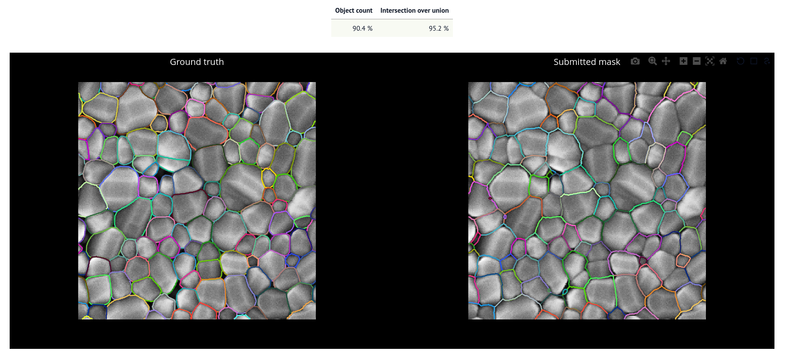

# Segmentation Challenge

The goal of this challenge is to let you practice your segmentation skills by developing automated segmentation workflows for a selection of images.

You can use any tool you want ([Fiji](https://fiji.sc/), [MorpholibJ](https://imagej.net/plugins/morpholibj), [Scikit-image](https://scikit-image.org/), [CellPose](https://www.cellpose.org/), [SAM](https://github.com/facebookresearch/segment-anything), [Ilastik](https://www.ilastik.org/)...) to generate your segmentation masks. The idea is to test and figure out which methods work best for each image.

## Images

The challenge images are located in the [`Images`](./public/Images/) folder. For each image, a *ground truth* segmentation mask is available in the [`Ground_Truths`](./public/Ground_Truths/) folder. These ground truth masks have been carefully edited to be as close as possible to an ideal result.


| Image      | Description | Credit |
| ---------- | ----------- | ------ |
| [sunflowers.tif](https://github.com/EPFL-Center-for-Imaging/segmentation-challenge/blob/56c4cc4e8e0153f9fa9b4c27dbe84a54452e7074/public/Images/sunflowers.tif) | An optical image of sunflower seeds. | Courtesy of Daniel Sage, EPFL |
| [fish.tif](https://github.com/EPFL-Center-for-Imaging/segmentation-challenge/blob/56c4cc4e8e0153f9fa9b4c27dbe84a54452e7074/public/Images/fish.tif) | A historical drawing of fish in the Limat river. | Viatimages @ Unil |
| [grains.tif](https://github.com/EPFL-Center-for-Imaging/segmentation-challenge/blob/56c4cc4e8e0153f9fa9b4c27dbe84a54452e7074/public/Images/grains.tif) | An SEM image of a grain structure. | Courtesy of Nanolab @ EPFL, Anna Varini |

## Evaluate your segmentation

You can evaluate your segmentation mask and see how it compares to the “ground truthˮ using our web dashboard:

[➡️ Web Dashboard](https://epfl-center-for-imaging.github.io/segmentation-challenge/)



Your segmentation masks should be labeled arrays with values representing instances. They should have the same size (number of pixels in X and Y) as the original image. They should be saved as a TIFF file.

The quality of your segmentation mask is evaluated based on two metrics:

- **Object count** relative to the ground truth count.
- **Intersection over union (IoU)** computed on the binary version of the mask.

We also average both scores to give an overall score.

**Shared folder**

If your workshop organizers have prepared a shared Jupyterlab session, you can upload your segmentation mask files (in TIFF format) by drag and dropping them into the [`Submissions`](./Submissions/) folder on Jupyter lab, so that you can also see how they compare to other submissions.

## Solutions

A few reference segmentation workflows are available in the [solutions](./solutions/) folder. We encourage you to take a look at them *after* the workshop!

---
## Setup (for workshop organizers)

**Intitial setup**

- Download or clone this repository on your computer.
- Install the Python [requirements.txt](./requirements.txt).
- Run the script [setup.py](./Scripts/setup.py) for the initial setup.

**Run a shared Jupyter lab session**

First, set up a password for Jupyter lab:

```
jupyter server password
```

Then, start juptyer lab with:

```bash
jupyter lab --ip=`0.0.0.0`
```

Take note of your IP address, and share a link to the jupyter lab session (and password) with participants. Ask them to drag and drop their segmentation mask files into the `Submissions` folder of the shared Jupyter lab to upload them.

**Compute and display the leaderboards**

In the shared Jupyter lab session:

1. Open a new terminal. Run [leaderboard.py](./Scripts/leaderboard.py) to compute the leaderboards periodically.

```bash
python leaderboard.py
```

2. In a new terminal window, run [display.py](./Scripts/display.py) to display the leaderboard of a particular challenge:

```bash
python display.py grains
```

Repeat this process for all challenges, then reorganize the layout so that the leaderboards are visible side-by-side:

